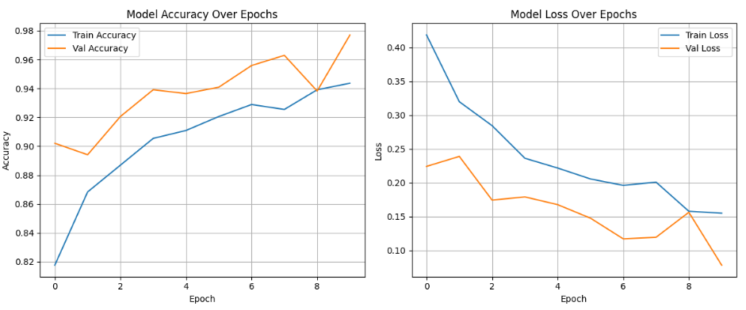

# 😷 Mask Detection Using Computer Vision 
This project is a CV-based solution for detecting whether a person is wearing a mask or not. It uses  "Convolutional Neural Networks(CNN)" to achieves high accuracy in real-world scenarios. 

# 📌 Project Overview 
The goal of this project is to: 

-Detect faces in images. 
-Classify whether each detected face is with mask or without mask. 
-Display the confidence level 

# 🛠️ Tech Stack 
-Python 3 
-TensorFlow / Keras 
-OpenCV 

# ✅ Key Features 

-Real-time or static image prediction 
-Training and validation pipelines with Keras & TensorFlow 

# 📂 Data 
The data is directly downloaded from Kaggle in the .ipynb file. 
For Analysis, Sample Images of the used labelled images are in the data folder. 
 

# 📊 Results 
🔹 Testing Accuracy 
- Final Test Accuracy: 97.18% 

🔹 Training Graphs 

 

🔹 Predicted Sample Images 
Here are examples of predictions: 

  
  
  

