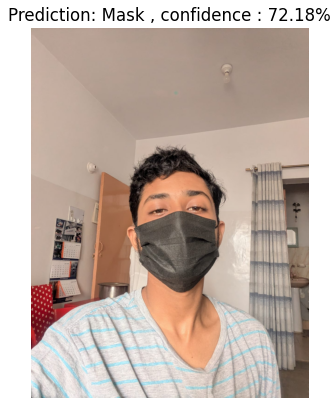
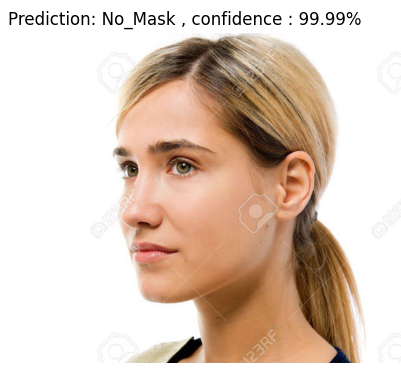
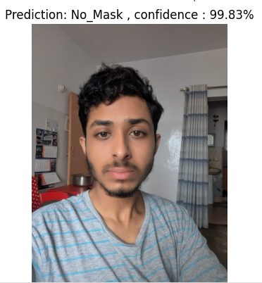

😷 MASK DETECTION USING COMPUTER VISION 
This project is a CV-based solution for detecting whether a person is wearing a mask or not. It uses  "Convolutional Neural Networks(CNN)" to achieves high accuracy in real-world scenarios.

📌 PROJECT OVERVIEW
The goal of this project is to:

-Detect faces in images.
-Classify whether each detected face is with mask or without mask.
-Display the confidence level

🛠️ TECH STACK
-Python 3
-TensorFlow / Keras
-OpenCV

✅ KEY FEATURES

-Real-time or static image prediction
-Training and validation pipelines with Keras & TensorFlow

📂 DATA 
The data is directly downloaded from Kaggle in the .ipynb file.
For Analysis, Sample Images of the used labelled images are in the data folder.
 

📊 RESULTS
🔹 Testing Accuracy
- Final Test Accuracy: 97.18%

🔹 Training Graphs

!["Graph"][results/graph.png]

🔹 Predicted Sample Images
Here are examples of predictions:

  
  
  

